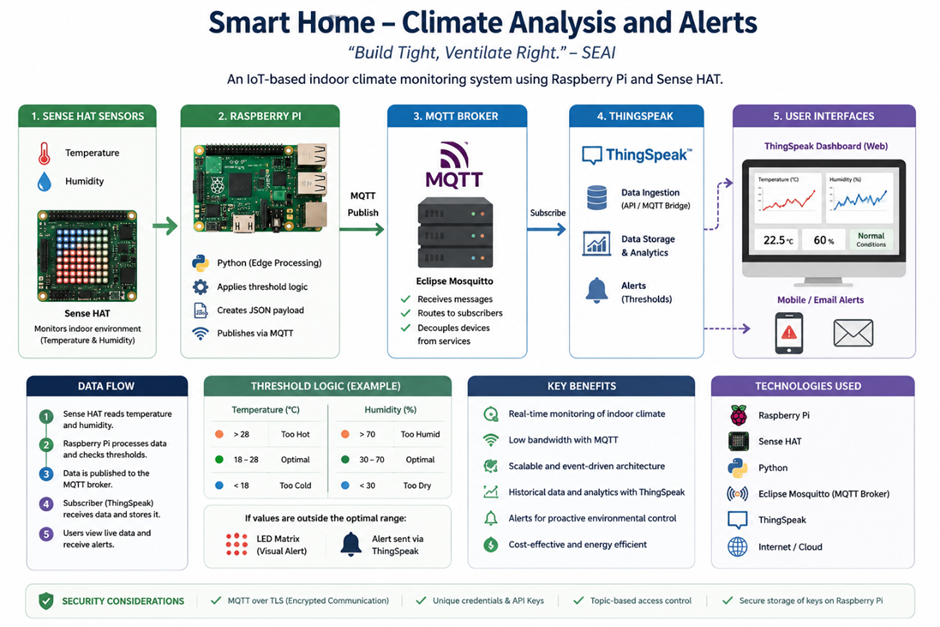

# RPi_IOT_Application

## Chloe Croydon 20119102

Repository: https://github.com/ChloeKC/healthyhome

Project Folder: cd ~/healthyhome source .venv/bin/activate

### "Healthy Home" - Smart Environment Analysis and Alert System

## Introduction

This project implements an IoT-based indoor climate monitoring system using 
a Raspberry Pi and attached Sense HAT. The device collects temperature and 
humidity data at regular intervals, applies threshold-based logic to classify 
environmental conditions, and publishes structured JSON messages via MQTT. 

A cloud-based dashboard (Blynk) visualises the data and provides real-time alerts 
when conditions fall outside optimal ranges. The project demonstrates edge 
processing, network communication, and user-facing visual statistics, within an 
event-driven IoT system. Utilizing user-friendly system architecture and 
protocols to establish accessibility, security and the separation of concerns.

#### [Sensors] → [Edge Processing] → [MQTT] → [Backend / Logging / Analytics Dashboard] → [User Interface]

####     [Sense HAT] → [Raspberry Pi] → [SSH/Blynk]     →     [Blynk Dashboard]     →     [Mobile Apps]

A cost saving, health and environment friendly solution for air quality and 
temperature regulation in a fully insulated, airtight environment without 
adequate mechanical ventilation and heat recovery. Monitoring consequent air 
temperature, pressure, moisture and mould issues, with further possibilities 
for excess VOC, CO2 and Radon detection. 

‘Airtight houses experience negative pressure, which could reduce airflow’ 
								A. Bailes III. 
This could lead to back drafting where combustion gases, a cooker hood for 
example, are pulled back into the house.

##### “Build Tight, Ventilate Right.” SEAI

The Sense HAT(IoT device) monitors environmental conditions and the Raspberry Pi
(MQTT Client) processes data locally with Python scripting. The collected data is 
forwarded to Blynk (MQTT Broker) who publishes the processed telemetry and insights 
via subscribed UI apps(web) and notification systems(smartphone, email). Utilizing 
event-driven architecture to provide real-time alerts, via push notifications, when 
conditions go outside an optimal, predefined threshold.

## Tools, Technologies and Equipment
An edge IoT device monitors indoor climate and sends structured data to a service, 
which processes it and provides alerts and a dashboard.

### Sense HAT:
Monitors temperature and humidity and notifies user visually, with LED indicators, 
when values fall outside optimal range. Displays red for hot or high humidity and 
blue for cold or low humidity.

### Raspberry Pi:
RPi OS. Debian based, Linux distribution, reads sensor values every minute.

### Home Network:
Connected devices communicate and share resources, including computers, smartphones, 
tablets, Rpi, sensors and other smart devices.

### Python over SSH:
Python script processes data collected from RPi, checks if it's within normal range and 
logs it. Then securely forwards data in Json files to Blynk/MQTT dashboard, which 
publishes telemetry to subscribers with alerts and storage.

### MQTT Broker/Blynk:
EDA alerts user remotely via web dashboard and mobile app. It reliably filters, aggregates 
and streams transformed data as visual information/statistics to users (decoupled design). 
Ensures reliable and efficient data transport with Last Will & Testament LWT feature.

### Write to file:
Log live climate IoT data, storing diverse data from multiple sources.

### Github:
GitHub commits for project development documentation.

### Packet Tracer / Digital Twin:
Simulate scenarios that are difficult to create for testing. Update PT sensor to send 
telemetry data using bridging module. Develop sensor module on RPi that listens for UDP's 
from PT sensor.

### Smart Plugs:
Remote climate control and intuitive home automation.

### HTML:
Future potential for adding live, home climate conditions to the Whether Weather App, 
indoor/outdoor comparisons.

### Demonstration:
Youtube video/demo.

## Network Topology

## Testing & Data Analysis:

RPi and Sense HAT setup in living space, collecting cumulative data to test the quality of 
python processing code, information gathering technique and published alerts and insights.

Blynk event and automation testing with simulated data, temperature/humidity spikes/troughs, 
for tracking events and alerts system.

Packet Tracer prototype to simulate a smart home network that utilize IoT devices and apps. 

Statistical analysis of home air quality i.e. comparative study with optimal temperature 
values. Useful for predictive model training for intuitive home assistant with smart hardware.

## Project Graphic:

## Findings:

The SenseHAT is good at measuring local environment, not a reliable
 measure of the air temp and humidity in the room. 
Offset neccessary or calibrate data against a reliable measurement device.
	## humidity = humdty * (2.5 - 0.029 * temp)
The humidity sensor on the SenseHAT generally reads too low 
because it is affected by heat from RPi CPU.
Or an adapter to seperate HAT from RPi. Or infrequent readings.
Display layer introduces delays during LED message rendering.
Git commits are difficult pull, conflict, resolve, rebase, push!
	
	## humidity = humdty * (2.5 - 0.029 * temp)

The SenseHAT is good at measuring local environment, but seemingly around 80% reliable for 
the air temp and humidity values in the room. 
Refinement: Offset or calibrate data against a reliable measurement device essential. 

	### humidity = humdty * (2.5 - 0.029 * temp) 

The humidity sensor on the SenseHAT generally reads too low as it is affected by heat 
from RPi CPU. 
Or an adapter to seperate HAT from RPi. Or infrequent readings. 
Display layer introduces delays during LED message rendering. 
Git commits are difficult pull, conflict, resolve, rebase, push.
