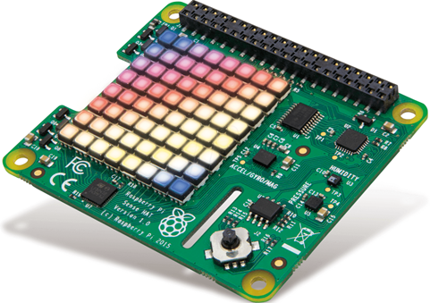
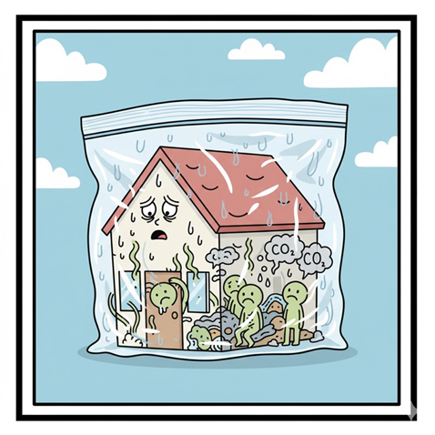
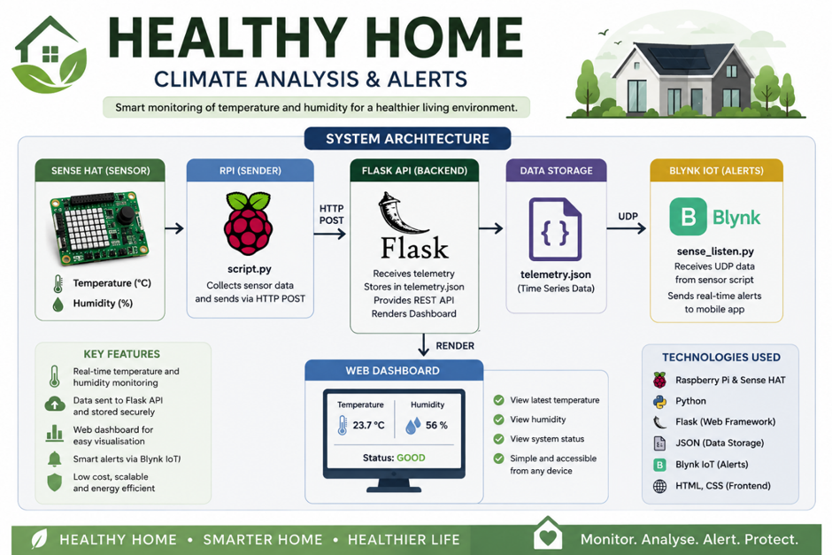
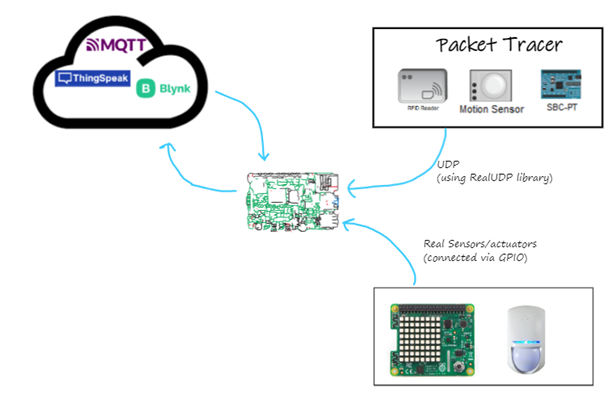
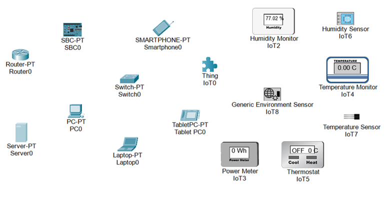

# RPi_IOT_Application

## Chloe Croydon 20119102

Demo: https://www.youtube.com/watch?v=zhIxvk1B-Ys
Repository: https://github.com/ChloeKC/healthyhome

## Healthy Home – Climate Analysis and Alert System
## 	Monitor 	• Analyse 	• Alert 	• Protect

### Healthy Home files:

healthyhome_api.py      (backend API, JSON storage & HTML)

script.py	 	(sensor + telemetry)

sense_listen.py 	(UDP simulation)

render.html 		(dashboard template)

telemetry.json 		(telemetry storage file)

blynk.py 		(notifications)

blynk_pt.py 		(simulated telemetry retrieval)

healthyhome.pkt 	(additional simulated telemetry source)

README.md 		(intro, graphic, instructions, etc)

## Instructions

	SSH
	cd ~/healthyhome
	source .venv/bin/activate
	
	healthyhome_api.py
	script.py
	sense_listen.py
	cat telemetry.json
	dashboard (http://localhost:5000)

	blynk.py
	blynk.pt.py
	Blynk Dashboard/Phone
	
	sudo shutdown

## Introduction

This project implements an IoT-based indoor climate monitoring system using a Raspberry Pi and Sense HAT. The device collects temperature and humidity data at regular intervals, applies threshold-based processing to update users with environmental conditions. The information is stored and published as structured JSON messages via MQTT and HTTP applications. A cloud-based dashboard visualises the data and provides real-time alerts when conditions fall outside optimal ranges. The project demonstrates edge processing, network communication, and user-facing visuals within an event-driven IoT system. Utilizing user-friendly system architecture and protocols to establish accessibility, security and the separation of concerns:

####   Sensors → Edge Processing → Telemetry Simulation → HTML/MQTT → Backend API → Dashboard Service → User Apps

####   Sense HAT →  RPi/Python → Packet Tracer → Flask/Render/Blynk → Blynk Dashboard → Mobile Interfaces

A cost saving, health and environment friendly solution for air quality and temperature regulation in a fully insulated, airtight environment without adequate mechanical ventilation and heat recovery. Monitoring and solving consequent air temperature, pressure, moisture and mould issues. 

##### "Airtight houses experience negative pressure, which could reduce airflow" A. Bailes III. 

Further potential for excess VOC, CO2 and Radon detection. And monitoring for negative pressure which causes back drafting (combustion gases are pulled back into the house).

##### “Build Tight, Ventilate Right.” SEAI

The Sense HAT(IoT device) monitors environmental conditions and Raspberry Pi(MQTT Client) processes data locally with Python scripting. The collected data is transformed and forwarded to Blynk and Render dashboards. The processed telemetry and insights can then be published via subscribed UI apps(web) and notification systems(smartphone, email). Utilizes event-driven architecture to provide real-time alerts via push notifications when conditions go outside an optimal, predefined threshold.

#### Ventilation 	Mould Prevention 	Thermal Comfort	Smart/Remote Control

####     Indoor Environment Monitoring 	Future VOC / CO₂ / Radon Sensing

## Project Graphic 
(Generated OpenAI (2026) Image generated using ChatGPT (GPT-5.5))

## Tools, Technologies and Equipment
An edge IoT device monitors indoor climate and sends structured data to a service, 
which processes it and provides alerts and a dashboard.

Sense HAT          Packet Tracer UDP
     ↓                   ↓    
     sensor_service.py
               ↓	  HTTP POST JSON	
	udp_listener.py
               ↓
    			 Flask Backend API
               ↓
          Telemetry .JSON
               ↓
     Blynk Dashboard / Web API

### Sense HAT:
Monitors temperature and humidity and notifies user visually, with LED indicators, 
when values fall outside optimal range. Displays red for hot or high humidity and 
blue for cold or low humidity.

### Raspberry Pi:
RPi OS. Debian based, Linux distribution, reads sensor values at regular intervals.

### Home Network:
Connected devices communicate and share resources, including computers, smartphones, 
tablets, Rpi, sensors and other smart devices.

### Python over SSH:
Python script processes data collected from RPi, checks if it's within normal range and 
logs it. Then securely forwards data in Json files to Blynk/MQTT dashboard, which 
publishes telemetry to subscribers with alerts and storage.

### MQTT Broker/Blynk:
EDA alerts user remotely via web dashboard and mobile app. It reliably filters, aggregates 
and streams transformed data as visual information/statistics to users (decoupled design). 
Ensures reliable and efficient data transport with Last Will & Testament LWT feature.

### Flask/Storage:
Backend system for data ingestion/storage, potential to handle diverse data from multiple IOT.

### HTML:
GET & POST methods for data retrieval and server delivery, stored in the request body of HTTP request for securely logging and displaying live home climate conditions to Flask Web API. 

### Github:
GitHub commits for project development documentation.

### Smart Plugs:
Remote climate control and intuitive home automation.

### Demonstration:
Youtube video/demo.

### Packet Tracer / Digital Twin:
Simulates scenarios that are difficult to create for testing. Update PT sensor to send 
telemetry data using bridging module. Develop sensor module on RPi that listens for UDP's 
from PT sensor.

## Network Topology/Prototyping

### Simple Home Network in Packet Tracer:
Configured Network Devices
Simulated IoT/Senser Devices
Telemetry Ingestion 
UDP transport Protocol
Sensor Listener
Threaded Network
Packet Handling
Blynk Integration

## Testing & Data Analysis:

RPi and Sense HAT setup in living space, collecting cumulative data to test the quality of python processing code, information gathering technique and published alerts and insights.

Blynk event and automation testing with simulated data, temperature/humidity spikes/troughs, for tracking events and alerts system.

Packet Tracer prototype to simulate a smart home network that utilize IoT devices and apps.

Statistical analysis of home air quality i.e. comparative study with optimal temperature values. Useful for predictive model training for intuitive home assistant with smart hardware.

## Problems/Findings:

The temperature sensor on the SenseHAT generally reads too high as it is affected by heat from RPi CPU.
The humidity sensor generally reads too low because it is also affected by heat.
Display layer introduces delays during LED message rendering. 
Git commits difficult: pull, conflict, resolve, rebase, push.

### Solutions:

An adapter to separate HAT from RPi. Infrequent readings.
Offset gauge by ≈ 20% for air temperature and humidity values in the room.
Calibrate data against a reliable measurement device essential. 
LED visual feedback prioritised over telemetry frequency.

### Conclusions:

The SenseHAT is good at measuring local environment, although not 100% reliable for measure of the air temp and humidity in the room without calibration. 
The humidity was frequently too low in the rooms downstairs, as these are bedrooms not the main living area, low temperatures can be obtained for suitable sleep conditions. Maybe even adding a smart humidifier to the Healthy Home system. 
Fortunately, the upstairs high humidity and temps can now be monitored to establish a healthy home environment.
Unfortunately, I could not get every component to operate together, the REST API dashboard for example is not rendering. Also, I ran out of time to create a graphic so ChatGPT had to do that job for me.
The packet tracer simulation piece is also incomplete, I may have underwhelmed in the proposal and then overshot my capabilities with the actual project.

I have learnt an enormous amount from the RPi/IOT project and have the IoT architecture and networking knowledge to implement "Healthy Home" in our home.

### References:

Blynk | Smart Home IoT Platform (no date). Available at: https://blynk.io/solutions/smart-home (Accessed: April 26, 2026).
Build a REST API using Flask - Python (18:05:48+00:00) GeeksforGeeks. Available at: https://www.geeksforgeeks.org/python/python-build-a-rest-api-using-flask/ (Accessed: May 24, 2026).
ChatGPT (no date) ChatGPT. Available at: https://chatgpt.com/ (Accessed: May 24, 2026).
Computer Systems & Networks (no date). Available at: https://tutors.dev/course/setu-cert-comp-sci-2026-comp-sys-net (Accessed: May 12, 2026).
HTTP Methods GET vs POST (no date). Available at: https://www.w3schools.com/tags/ref_httpmethods.asp (Accessed: May 22, 2026).
Jacques, K. (2023) “Do Airtight Houses Need Makeup Air?,” GreenBuildingAdvisor, 3 August. Available at: https://www.greenbuildingadvisor.com/Allison A. Bailes III, PhD (Accessed: May 18, 2026).
Jamestdsmith (2025) “External Wall Insulation Dublin: The Mistake That Could Make Your Home Toxic,” Retrofit Dublin, 2 October. Available at: https://blog.retrofitdublin.ie/external-wall-insulation-dublin-ventilation-mistake/ (Accessed: April 26, 2026).
Molyneaux, B. (no date) Paths in Python: Comparing os.path and pathlib modules, Python Snacks. Available at: https://www.pythonsnacks.com/p/paths-in-python-comparing-os-path-and-pathlib (Accessed: May 12, 2026).
“OpenAI (2026) Image generated using ChatGPT (GPT-5.5) from a user prompt. Generated 24 May 2026. Available at: https://chat.openai.com/” (no date).
POST request method - HTTP | MDN (2025) MDN Web Docs. Available at: https://developer.mozilla.org/en-US/docs/Web/HTTP/Reference/Methods/POST (Accessed: May 22, 2026).
Request: json() method - Web APIs | MDN (2025) MDN Web Docs. Available at: https://developer.mozilla.org/en-US/docs/Web/API/Request/json (Accessed: May 22, 2026).
Services, G.-I.C. (2025) “How do you expose API endpoints?,” Medium, 13 June. Available at: https://medium.com/@sanidhyacomnetinfo/how-do-you-expose-api-endpoints-f33d503b4cf5 (Accessed: May 24, 2026).
Syncing your branch in GitHub Desktop (no date) GitHub Docs. Available at: https://docs-internal.github.com/en/desktop/working-with-your-remote-repository-on-github-or-github-enterprise/syncing-your-branch-in-github-desktop (Accessed: May 5, 2026).
Use jsonify() instead of json.dumps() in Flask (19:31:41+00:00) GeeksforGeeks. Available at: https://www.geeksforgeeks.org/python/use-jsonify-instead-of-json-dumps-in-flask/ (Accessed: May 22, 2026).
What is APIPA (Automatic Private IP Addressing)? (15:45:42+00:00) GeeksforGeeks. Available at: https://www.geeksforgeeks.org/computer-networks/what-is-apipa-automatic-private-ip-addressing/ (Accessed: May 20, 2026).
Yoyo (2026) “Sense HAT Projects: 10 Things You Can Build with This Versatile Add-on,” PCBSync, 21 January. Available at: https://pcbsync.com/sense-hat-projects/ (Accessed: May 13, 2026).

